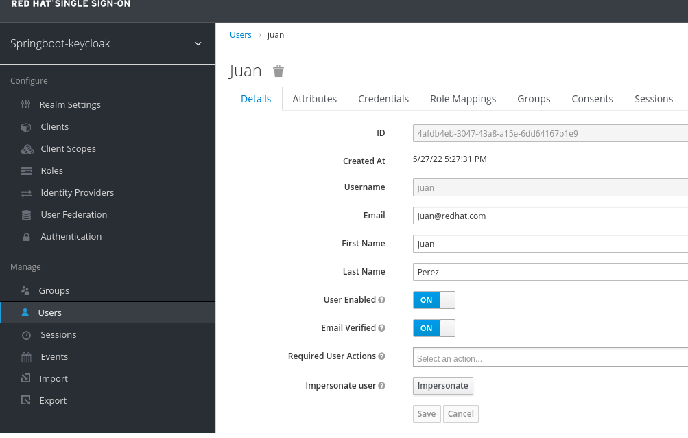
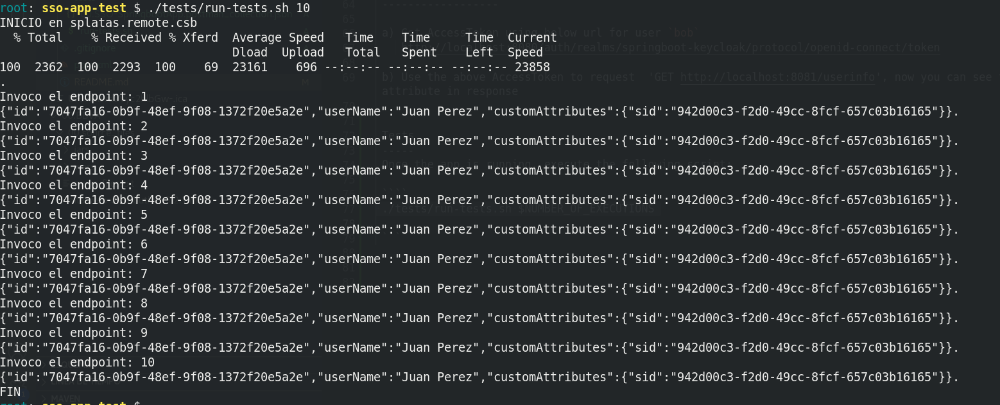

springboot-user-attributes: SpringBoot REST Service
====================================================


What is it?
-----------

The `springboot-user-attributes` demonstrates how to set custom attributes for a user
and retrieve them from AccessToken. We write a RESTful service with SpringBoot 
that is secured with <span>Keycloak</span>.

There are 2 endpoints exposed by this service:

* `public` - requires no authentication
* `userinfo` - can be invoked by users with the `user` role and returns login user attributes 


System Requirements
-------------------

All you need to build this project is 

* Java 11 (Java SDK 1.11) or later 
*  Maven 3.3.8 or later.
*  Keycloak Server version 8.0.1

Configuration in <span>Keycloak</span>
--------------------------------------

Prior to running this application you need to configure keycloak

*  Create realm `springboot-keycloak`
*  Create client `springboot-user-attributes` under realm `springboot-keycloak` and set `Access Type` as `bearer-only`
*  Create realm level role 'user'
*  Create user `juan` and assign role 'user'
*  Set Attribute for the user `juan` , set key as `mobile` and value as `666-66-66-66`

 Setup `public` client to test custom user attributes

 Note : Protocol mappers are available only for public or Confidential clients

 *  Create client `postman` under realm `springboot-keycloak` and set `Access Type` as `public`
 *  Create a mapper for client `postman`, map 'mobile' user attribute and enable `Add to access token`


Build and Run the springboot-user-attributes
--------------------------------------------

1. Open a terminal and navigate to the root directory of this springboot-user-attributes.

2. Build application
   ```
    mvn clean install
    ```
2. Start springboot-user-attributes application using below command

   ````
   mvn spring-boot:run

   ````


Test using postman
------------------

a) Get AccessToken using below url for user `bob`
   http://localhost:8080/auth/realms/springboot-keycloak/protocol/openid-connect/token
    
b) Use the above AccessToken to request  'GET http://localhost:8081/userinfo', now you can see the custom user attribute in response


Load tests
----------

Once the app is running, execute the following script:

 ````
 ./tests/run-tests.sh $NUMBER_OF_EXECUTIONS

 ````
 
This script will: 
  a) get a token (from SSO) 
  b) and then will consume 'userInfo' endpoint ($NUMBER_OF_EXECUTIONS times) with that token.

As result you should see the information of user 'Juan', defined on SSO:



````
./tests/run-tests.sh 10

````

